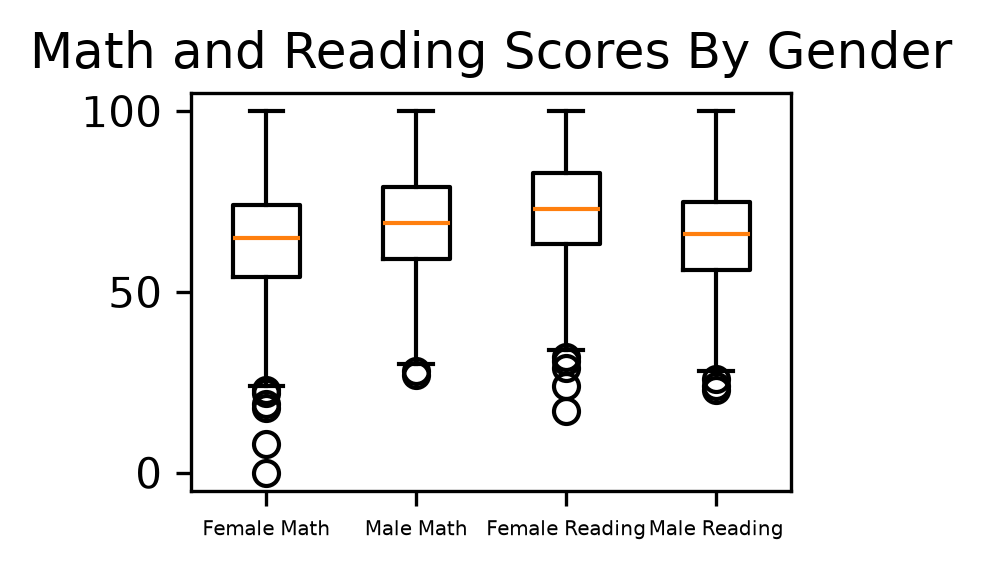
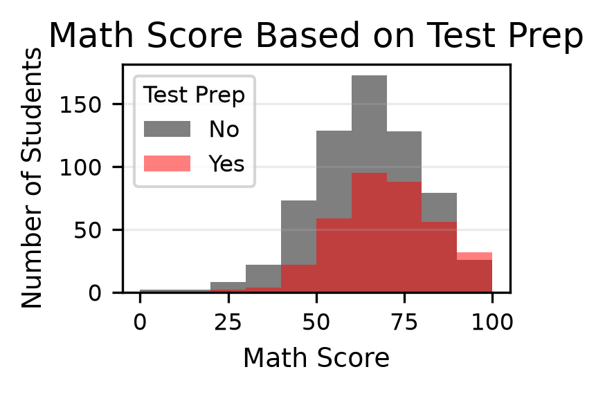
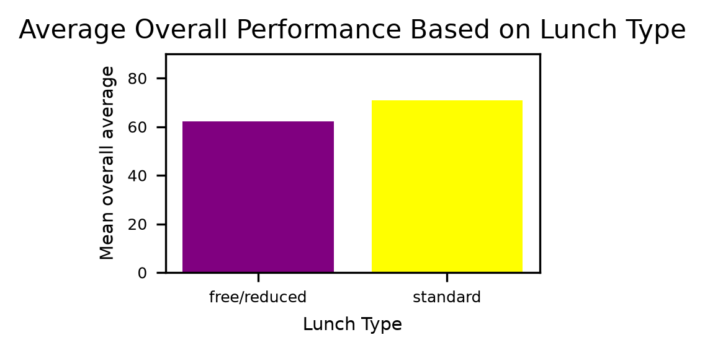
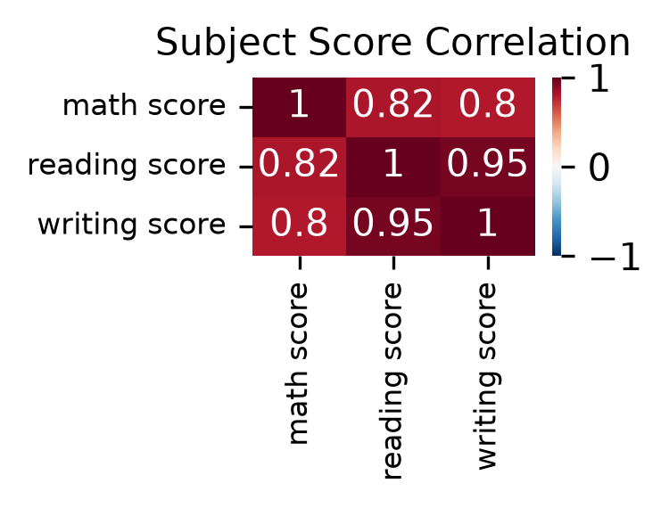
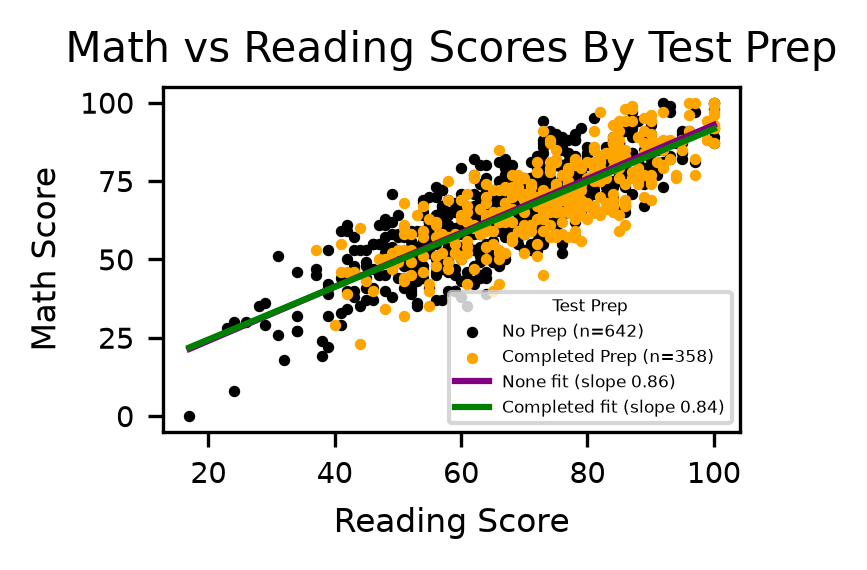

This visual shows that the males had a better math average. There were a couple of females the got relly low maht score. The females had a better reading avaergae but they also had a wider spread in their data. We can also see from the box plots that there was ALWAYS somone that got a 100 in each exam across both genders. 
   

For the second visual, there were more students that did not do test prep then studnets who did test prep. We can see that the students who completed the test preparations, had a higher mean math score. But when looking at the histogram it might seem like a differnt story. There were more studnets who did no prep and becasue of that the pool for that group is larger, hence showing a wider and taller in the histogram. With no test prep you were more likley to less than a 50 on the test.So the inverse is also true, having done test prep give you more of a chnace of getting a 90 or above. 
  

 The thrid visual shows that students that a standard lunch lad a higher overall average as compared to the students with free/reducded lunch. It looks like the mean for the free lunch is around 63 and for the standard lunch it seems to be around 72, having a 9 point difference. This shows sommething from an outside perspective also, which is that students that are getting free lunch will not have access to the same materials & resources as the studnets with a standard lunch. Families on the standard lunch plan might be able to afford afford extra lessons, tutors and pracite mateiral for their kids, thus the correlation of how the students with standard lunch have a higher mean for overall average scores. 
  

The fourth visual shows that all subjects have a strong positive correlations. The strongest correlation is between reading and writing, at 0.95. Then we have math and reading at 0.82. Lastly we have math and writing at 0.80. This shwos that the overall patter is that is a student excels at one of these subject tests then he or she will also most likely do well on the other tests as well. However the same can also be said about the other side, where if a student fails one of these test then they are also likely to fail the others. 
 

The fifth and final visual shows us that the two trend lines are almost idetical. When I calcuated the slop of each line the studentes who did no prep had a slope of .86 and the students who had completd the prep had a slope of .84. This is a .02 difference. So this shows that the test prep does not meaningfully impact the relationship between reading and math scores. Like previoulsy identified both math and reading scores were strongly postivley assoicated. We do also have to take into consideration that there were more students that did no prep than studnets that had completed prep, if the dataset had been more evenly distributed then maybe we would have seen a bigger difference reading and math scores.

 
